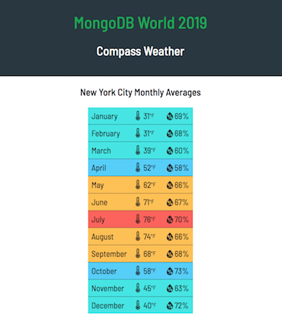

# Compass for Developers
## MDBW 2019

This is a simple web application to demonstrate how aggregation pipelines are a powerful tool to run some analytics queries
in MongoDB and how easy it is to inspect and interact with data in Compass and how quickly you can build and debug complex
aggregations with the Aggregation Pipeline Builder in Compass.

### How to set up and run the application

After checking out the repository, run `npm install` to install the dependencies. Then go to [Darksky](https://darksky.net), create an account if you don't have one and [get your secret key](https://darksky.net/dev/account).

Copy `config.example.json` to `config.json` and add your secret key in there.

Run MongoDB locally and with `mongoimport` import `data/nyc_weather_data.json` to a database named `mdbw19` into a collection named `nyc_weather_data`. The collection contains hourly weather observations for NYC from the beginning of 2012 almost to the end of 2017.

At this point, run `npm start` or `npm run dev` and go to [localhost:3000](http://localhost:3000/).

You should see a webpage similar to the image below.

The real-time data is fetched from Darksky, the average weather conditions are calculated with an aggregation directly in MongoDB. During the session at MDBW we will see how to build and debug the correct pipeline in Compass.

If you go to http://localhost:3000/historical-weather, you will see a summary of the monthly average temperatures.

